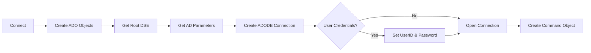
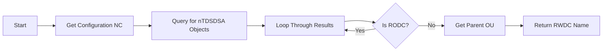

# LS_ActiveDirectory_Lib Flowchart

This document provides a flowchart of the LS_ActiveDirectory_Lib LotusScript library.

## Main Connection Flow

```mermaid
flowchart TD	N
    start[Start] --> init[Initialize Variables]
    init --> setDomain[Set Domain Name]
    setDomain --> connect{Connect to AD}
    connect --> isRODC{Is RODC?}
    isRODC -->|Yes| reconnect[Reconnect to RWDC]
    isRODC -->|No| connected[Connected to AD]
    reconnect --> connected
    connected --> end[End]
```

## AD Connection Details



## RWDC Discovery Flow



## Notes

The library provides the following key functionalities:

1. Connection to Active Directory via LDAP
2. Automatic Read-Write Domain Controller (RWDC) DetKction
3. Support for both authenticated and current user contexts
4. Error handling and reporting

The library is designed to handle Active Directory connections and operations in a robust manner, with automatic fallback to RWDC when needed.
